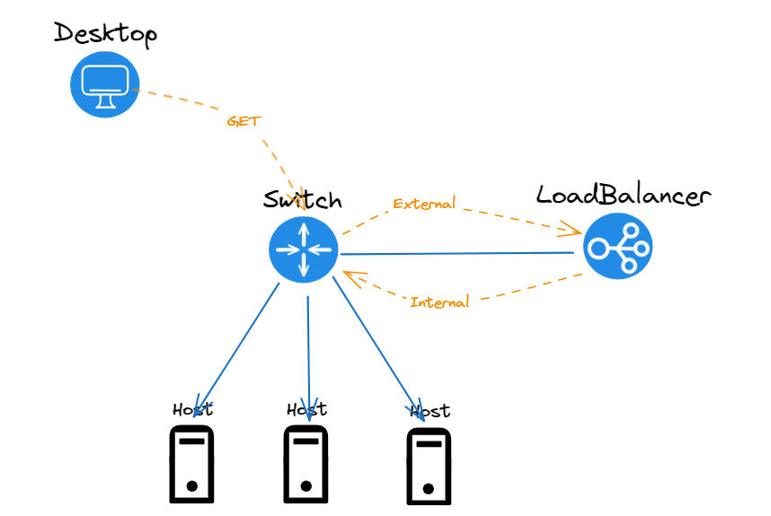

# 1 环境
## 1.1 负载均衡
- F520.com.cn
  - admin/cisco0123 Root/cisco0123
  - mgmt 172.15.1.10
  - internal 
    - vlan:int 1.1 
    - self: 172.15.1.12/28 no-floating 172.15.1.14/28 flaoting
  - external
    - vlan:int 1.2
    - self: 192.168.100.251/24 no-floating 192.168.100.253/28 flaoting
  - ha 10.10.10.1 1026
- F521.com.cn
  - admin/cisco0123 Root/cisco0123
  - mgmt 172.15.1.20
  -   - internal 
    - vlan:int 1.1 
    - self: 172.15.1.13/28 no-floating 172.15.1.14/28 flaoting
  - external
    - vlan:int 1.2
    - self: 192.168.100.252/24 no-floating 192.168.100.253/28 flaoting
  - ha 10.10.10.2 1026
## 1.2 服务器
- node1:192.168.100.1
- node2:192.168.100.2
- node3:192.168.100.3
## 1.3 拓扑

# 2 应用节点
启动http服务，并获取服务器ip
后续开始扩展获取http内的其他字段，用来检验负载均衡的各类功能

```python
import os
import sys
from http.server import BaseHTTPRequestHandler,HTTPServer

Server = sys.argv[1]
IP = sys.argv[2]

class myHandler(BaseHTTPRequestHandler):
    def do_GET(self):
        self.send_response(200200)
        self.send_header('Content-type','text/html')
        self.end_headers()
        self.wfile.write(bytes("Server" + Server + ", IP" + IP, "utf-8"))
        return

try:
    server = HTTPServer(('',80),myHandler)
    server.serve_forever()
except KeyboardInterrupt:
    server.socket.close()

# linux : python3 main.py member1 172.15.1.100
```
